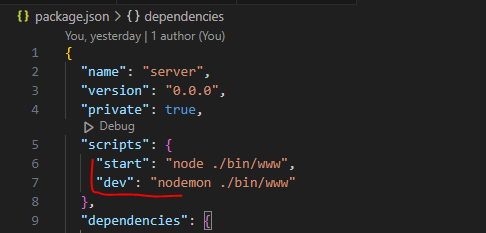
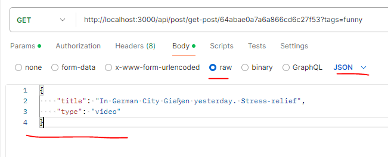

# Nodejs

## Environment

<details>
  <summary>Install nodejs window</summary>

> Cài nodejs trên window rồi chạy project như bình thường  
> Hoặc cài máy ảo ubuntu lên window sử dụng wsl, sau đó cài nodejs lên ubuntu. Rồi chạy nodejs project trên máy ảo  
> Ta vẫn code và test ở bên window qua localhost như bình thường  

</details>

<details>
  <summary>Install nodejs ubuntu</summary>

> apt install sẽ lấy về bản nodejs rất thấp. Cần set lại repo  
> cd ~  
> curl -sL <https://deb.nodesource.com/setup_20.x> -o /tmp/nodesource_setup.sh  
> sudo bash /tmp/nodesource_setup.sh  
> sudo apt install nodejs  
> node -v  Vậy là xong

</details>

<details>
  <summary>Upload source code to ubuntu</summary>

>Nên lưu source code ở đây:  /var/www/
>Sử dụng Filezilla  
>Push lên repo xong clone  
>Dùng scp command để truyền file lên  

</details>

<details>
  <summary>Phân quyền user</summary>

>Tạo thư mục cho dự án ở /var/www  
>sudo mkdir -p /var/www/node_base_project/  
>Folder có thể thuộc root. Đổi ownner về thành user của mình  
>sudo chown -R $USER:$USER /var/www/node_base_project/  
>Có thể user không có quyền chỉnh sửa thư mục. Update quyền  
>sudo chmod -R 755 /var/www/node_base_project/  

</details>

<details>
  <summary>Nginx</summary>

>Nginx sẽ tạo ra web service. Dù chưa chạy project node nào.  
>Cài Nginx web server vào ubuntu: sudo apt install nginx  
><https://www.digitalocean.com/community/tutorials/how-to-install-nginx-on-ubuntu-20-04>  
>service nginx status/start/stop: Check trạng thái running của nginx.

</details>

<details>
  <summary>Config nginx</summary>

>nginx sẽ load từ file /etc/nginx/nginx.conf  
>Trong này sẽ include các website từ /etc/nginx/sites-enabled/  
>Vào trong /etc/nginx/sites-available và thêm config của site mới vào  
>sudo vim /etc/nginx/sites-available/project_name  

```
server {
    listen 80;
    server_name base.yourdomain.com;

    location / {
        proxy_pass http://localhost:YOUR_NODEJS_PORT;
        proxy_http_version 1.1;
        proxy_set_header Upgrade $http_upgrade;
        proxy_set_header Connection 'upgrade';
        proxy_set_header Host $host;
        proxy_cache_bypass $http_upgrade;
    }
}
```

>Link site-available vào với site-enabled
```sudo ln -s /etc/nginx/sites-available/project_name /etc/nginx/sites-enabled/```
>Test lại nginx với sudo nginx -t  
>Restart or reload lại nginx: sudo systemctl restart nginx  

</details>

<details>
  <summary>How to run project?</summary>

> Đầu tiên npm install.
> Để chạy 1 file js thì ta cần gõ node filename.js  
> Nhưng trong node project thì có thể dùng npm.  
> Ở package.json cài đặt lệnh ở script. npm start là mặc định  
> Thêm lệnh thì dev thì cần npm run dev  
> nodemon dùng để auto run lại server khi sửa code  



</details>

<details>
  <summary>How to run on ubuntu server?</summary>

> Cài pm2
> sudo npm install -g pm2  
> cd đến đường dẫn của project  
> Chạy thử npm start
> Custom port với PORT=3001 npm start
>
> Chạy trên pm2
> pm2 start ./bin/www --name your_app_name --env production -- PORT=3001
> Test thử localhost bằng curl <http://localhost:3001>
>
> Để pm2 tự chạy project sau khi reboot thì:  
> pm2 save  
> pm2 startup  
> nó sinh ra 1 command phải chạy bằng sudo. copy -> chạy command đó  

</details>

## Syntax

<details>
  <summary>Check undefined</summary>

> Kiểm tra 1 biến có undefined: name === undefined  
> Kiểm tra 1 object property có undefined: user.hasOwnProperty('name')  

</details>

## Router

<details>
  <summary>Get query</summary>

> localhost:3000/post?start=1&limit=10  
> start và limit là query.  
> Lấy ra bằng cách gọi req.query  

</details>

<details>
  <summary>Get param</summary>

> localhost:3000/post/:postId/comment/:commentId  
> postId và commentId là param.  
> Lấy ra bằng cách gọi req.params  

</details>

<details>
  <summary>Get body</summary>

> {
    "title": "In German City",
    "type": "video"
}  
> body sử dụng json  
> Lấy ra bằng cách gọi req.body



</details>
