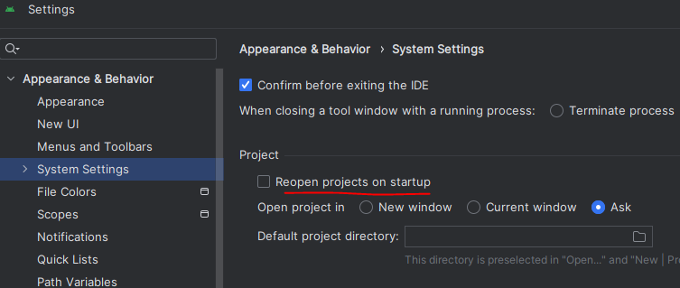
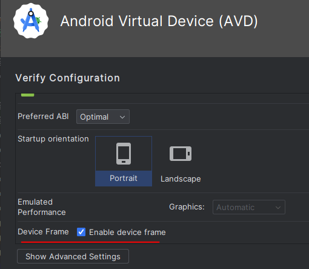
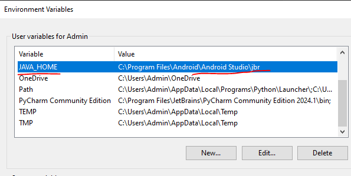

# Dev Notes

## Android studio

  
Not auto open the last project

>File -> Settings -> Appearance & Behaviour -> System Settings then you have a checkbox Reopen last project on startup

  
Bỏ cái frame của máy ảo

  
Đường dẫn của java mặc định

> C:\Program Files\Android\Android Studio\jbr\bin  
> Lưu ý có \bin

  
Cài đường dẫn java home

>C:\Program Files\Android\Android Studio\jbr
> Lưu ý không có \bin

