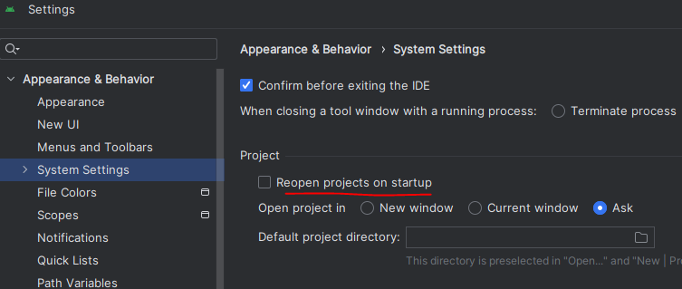
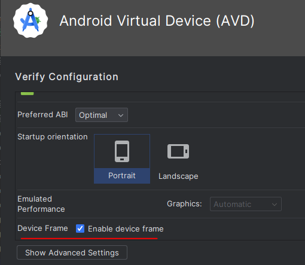
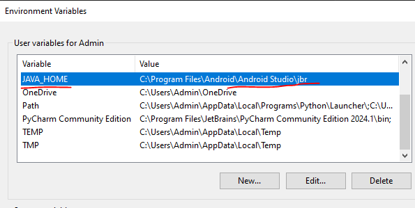

# Dev Notes

## Android studio

  
Not auto open the last project

>File -> Settings -> Appearance & Behaviour -> System Settings then you have a checkbox Reopen last project on startup

  
Bỏ cái frame của máy ảo

  
Đường dẫn của java mặc định

> C:\Program Files\Android\Android Studio\jbr\bin  
> Lưu ý có \bin

  
Cài đường dẫn java home

>C:\Program Files\Android\Android Studio\jbr
> Lưu ý không có \bin

# Flutter

  
Cài flutter bằng fvm

> Cài choco  
> Cài fvm qua choco
> Danh sách flutter version: fvm list  
> Sử dụng flutter version cho project hiện tại: fvm use 3.22.0  
> Sử dụng flutter version cho global: fvm global 3.22.0

# Git

  
warning: in the working copy of 'pubspec.lock', LF will be replaced by CRLF the next time Git touches it

> git config --global core.autocrlf true  
> Sau đó cứ commit lên  
> Người khác lấy về sẽ thành crlf  
> Mình bỏ local commit rồi pull lại cũng thành crlf

# Firebase

  
Setup

> Cần cài nodejs để có npm  
> Sau đó cài Firebase CLI = npm install -g firebase-tools  
> Sau đó là: firebase login
> Sau đó: dart pub global activate flutterfire_cli  
> Tạo project trên firebase  
> Cuối cùng là config: flutterfire configure
> Chọn cái project đã tạo là file firebase_options được tạo ra  
> Trong này có DefaultFirebaseOption để init.

